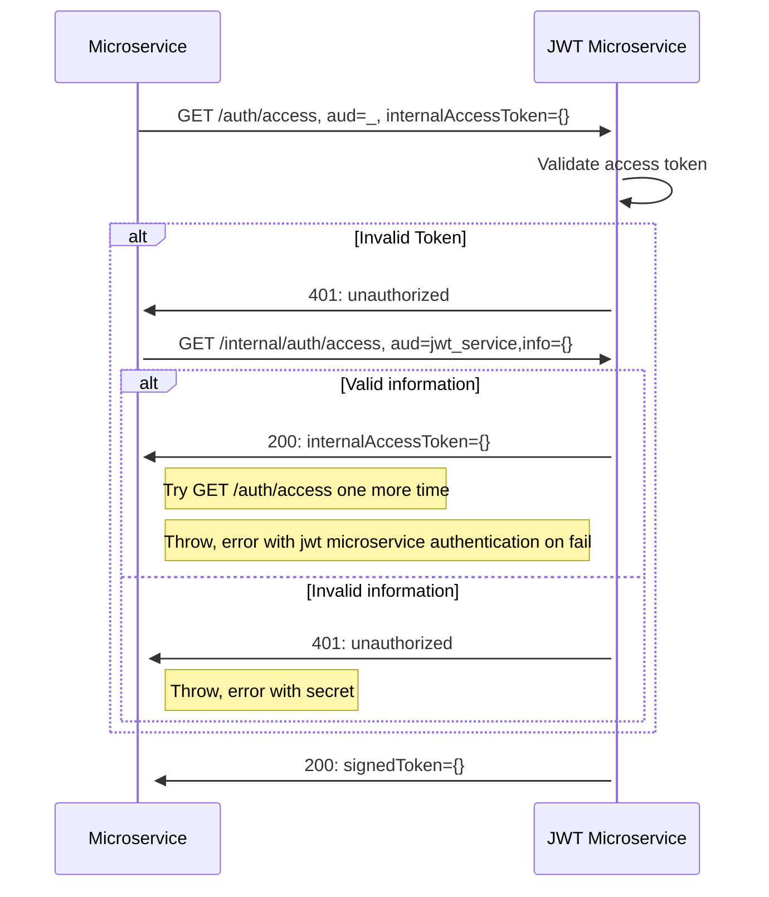
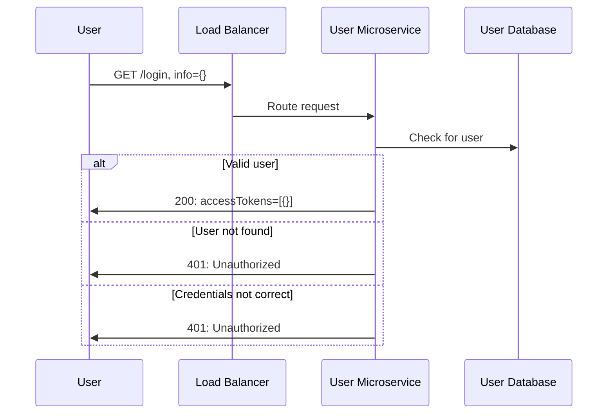
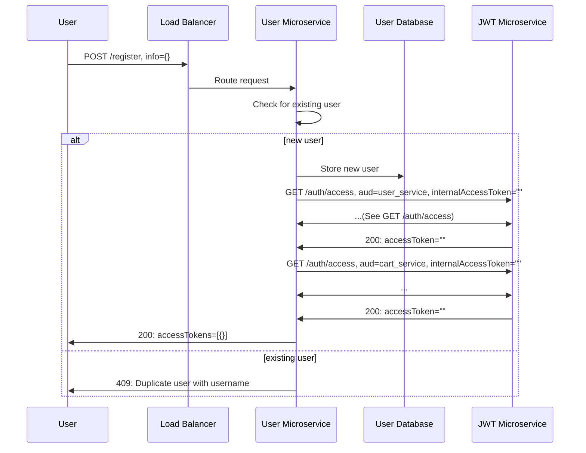

<!-- START doctoc generated TOC please keep comment here to allow auto update -->
<!-- DON'T EDIT THIS SECTION, INSTEAD RE-RUN doctoc TO UPDATE -->

- [Tech Stack](#tech-stack)
- [Microservices](#microservices)
- [JWT Endpoints](#jwt-endpoints)
  - [GET /internal/auth/access](#get-internalauthaccess)
  - [GET /auth/access](#get-authaccess)
- [User Endpoints](#user-endpoints)
  - [GET /login](#get-login)
  - [POST /register](#post-register)

<!-- END doctoc generated TOC please keep comment here to allow auto update -->

# Tech Stack
 - .NET
 - MSSQL
 - Docker

# Microservices
 - [X] User: User registration, login, and other account uses. Provides access tokens to other services. 
 - [X] Product: Getting and storing product information with company information. 
 - [ ] Shopping Cart: Handling user's cart and the products within them.

# JWT Endpoints

## GET /internal/auth/access

## GET /auth/access

# User Endpoints

## GET /login

## POST /register

